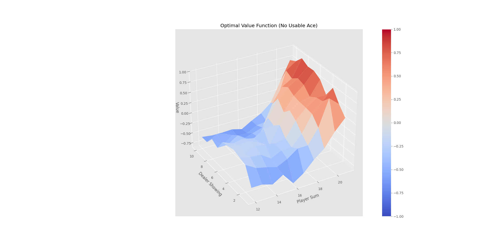

# exp1

韩佳乐 SA21218194

## mc

### first-visit

`observation` 和 `action` 作为一个元素存放在 `memory` 中，可以后面方便检索 `(s,a)` 是否重复出现。 `reward` 单独存放在 `rewards` 中。

```c
memory = []
rewards = []
```

使用 while 循环跑完一整个 eposide。

```c
observation = env.reset()
while True:
    choice = policy(observation)
    action = 0 if random.random() < choice[0] else 1
    new_observation, reward, done, _ = env.step(action)
    memory.append((observation, action))
    rewards.append(reward)
    observation = new_observation
    if done:
        break
```

倒序检查，对第一次遇到的状态计算其回报，并更新对应的 `Q` 值。`memory[t] not in memory[:t]` 可以方便的检查 `(s,a)` 是否第一次出现。

```c
G = 0
T = len(memory)
for t in range(T - 1, -1, -1):
    G = G + rewards[t]
    if memory[t] not in memory[:t]:
        s = memory[t][0]
        a = memory[t][1]
        returns_sum[s] += G
        returns_count[s] += 1
        Q[s][a] = returns_sum[s] / returns_count[s]
        policy = make_epsilon_greedy_policy(Q, epsilon, env.action_space.n)
```

### every-visit

与 first-visit 基本相同，只是无需检查 `(s,a)` 是否第一次出现。

## 结果

在 poltting.py 文件中加入 plt.savefig(...) 以保存图像。

<table>
    <tr>
        <td></td>
        <td>first-visit</td>
        <td>every-visit</td>
    </tr>
    <tr>
        <td>10000(No Usable Ace)</td>
        <td></td>
        <td></td>
    </tr>
    <tr>
        <td>10000(Usable Ace)</td>
        <td></td>
        <td></td>
    </tr>
    <tr>
        <td>500000(No Usable Ace)</td>
        <td></td>
        <td></td>
    </tr>
    <tr>
        <td>500000(Usable Ace)</td>
        <td></td>
        <td></td>
    </tr>
<table>

## td

### sarsa

在 `itertools.count():` 循环之前要作出动作选择

```c
action = np.argmax(Q[state]) if random.random() > epsilon else random.choice(np.arange(env.action_space.n))
```


```c
# step 1 : Take a step( 1 line code, tips : env.step() )
new_state, reward, done, _ = env.step(action)
# step 2 : Pick the next action
new_action = np.argmax(Q[new_state]) if random.random() > epsilon else random.choice(np.arange(env.action_space.n))
# step 3 : TD Update
# compute Q value      
Q[state][action] += alpha * (reward + discount_factor * Q[new_state][new_action] - Q[state][action])
state = new_state
action = new_action
if done:
    break
```

### qlearning

```c
# step 1 : Take a step
action = np.argmax(Q[state]) if random.random() > epsilon else random.choice(np.arange(env.action_space.n))
new_state, reward, done, _ = env.step(action)
# step 2 : TD Update
Q[state][action] += alpha * (reward + discount_factor * np.max(Q[new_state]) - Q[state][action])
state = new_state
if done:
    break
```

### double-qlearning

```c
# step 1 : Take a step
action = np.argmax(Q1[state]+Q2[state]) if random.random() > epsilon else random.choice(np.arange(env.action_space.n))
new_state, reward, done, _ = env.step(action)
# step 2 : TD Update
if random.random() > 0.5:
    new_action = np.argmax(Q1[new_state])
    Q1[state][action] += alpha * (reward + discount_factor * Q2[new_state][new_action] - Q1[state][action])
else:
    new_action = np.argmax(Q2[new_state])
    Q2[state][action] += alpha * (reward + discount_factor * Q1[new_state][new_action] - Q2[state][action])
state = new_state
if done:
    break
```

相比于 `qlearning`，`double-qlearning` 可以减少观察到的 `overestimations`，从而获得更好的性能。

### 结果（Episode Reward over Time）

<table>
    <tr>
        <td>sarsa</td>
        <td></td>
    <tr>
    <tr>
        <td>qlearning</td>
        <td></td>
    <tr>
    <tr>
        <td>dqlearning</td>
        <td></td>
    <tr>
</table>