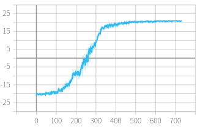

# lab2

韩佳乐 SA21218194

## PG

### 模型搭建

网络模型包括：一个大小为 input_size 全连接层，一个 ReLU 激活层，一个大小为 hidden_size 全连接层，一个 Sigmoid 函数。输出结果在 0~1 之间。

```c
self.policy = nn.Sequential(
    nn.Linear(input_size, hidden_size),
    nn.ReLU(True),
    nn.Linear(hidden_size, 1),
    nn.Sigmoid()
)
```

### 前向传播

由于输入为一维张量，形状为 [6400]，所以需要将其拓展为二维张量，形状为 [1, 6400]。输出也是二维张量，形状为 [1, 1]，通过切片把形状转化为 [1]。

```c
x = x.unsqueeze(dim=0)
prob_up = self.policy(x)[:, 0]

return prob_up
```

### rewards 计算

discounted_future_reward[t] = $\sum_{k=1} discount\_factor^k * reward[t+k]$

```c
discounted_future_reward = discount_factor * discounted_future_reward + rewards[t]
discounted_future_rewards[t] = discounted_future_reward
```

### 动作选择

选择动作 2 的概率为 prob_up，选择动作 3 的概率为 1 - prob_up。

```c
action = 2 if random.random() < prob_up else 3
prob = prob_up if action == 2 else 1 - prob_up
action_chosen_log_probs.append(torch.log(prob))
```

### loss 计算

$loss=-\frac{1}{N}\sum_{t=0}^T log(prob_t^{\theta})*G_t$

```c
loss = -torch.sum(action_chosen_log_probs * discounted_future_rewards)
return loss, rewards.sum()
```

## A2C

### 模型搭建 & 前向传播

#### PolicyNetwork

没改，和 PG 相同。

#### ValueNetwork

网络模型相比 PolicyNetwork，删除了 Sigmoid 函数，因为状态价值不能限制在 0~1 之间。

```c
self.value = nn.Sequential(

    nn.Linear(input_size, hidden_size),
    nn.ReLU(True),
    nn.Linear(hidden_size, 1)
)
```

前向传播

```c
x = x.unsqueeze(dim=0)
value = self.value(x)[:, 0]

return value
```

### rewards 计算

和 PG 相同。

### 动作选择

和 PG 相比，需要额外记录由价值网络估计的每个状态的 value 值

```c
action = 2 if random.random() < prob_up else 3
prob = prob_up if action == 2 else 1 - prob_up
action_chosen_log_probs.append(torch.log(prob))
values.append(value)
```

### loss 计算

$loss_p=-\frac{1}{N}\sum_{t=0}^T log(prob_t^{\theta})*(G_t-V_t^{\omega-})$

$loss_v=-\frac{1}{N}\sum_{t=0}^T (G_t-V_t^{\omega})^2$

```c
values = torch.cat(values)
advantage = discounted_future_rewards - values
loss_p = -torch.sum(action_chosen_log_probs * advantage.detach())
loss_v = torch.sum(torch.pow(advantage, 2))
return loss_p, loss_v, rewards.sum(), values.mean()
```

## 训练曲线

<table>
    <tr>
        <td align=center>PG</td>
        <td align=center>A2C</td>
    </tr>
    <tr>
        <td></td>
        <td></td>
    </tr>
</table>

## 优缺点对比

PG：对价值的估计虽然是无偏的，但方差较大。

A2C：有偏差，但能够有效降低方差。Actor的行为取决于 Critic 的 Value，但是因为 Critic 本身就很难收敛和 Actor 一起更新的话就更难收敛了。