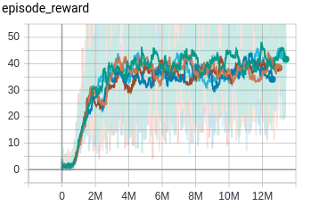
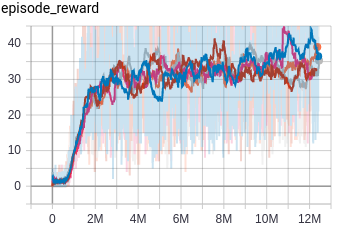
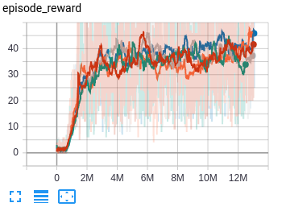
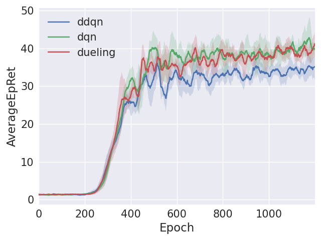

# lab3

韩佳乐 SA21218194

本次实验实现了 dqn ddqn dueling

## 框架的不足与修改

我认为本次框架存在几点不足：

- tensorflow 默认使用 `NHWC`，这适合 CPU 训练，但不适合 GPU，应改为 `NCHW`
- 叠帧，应为 4 次历史叠帧，而非当前帧重复 4 次。
- replay_memory 存储 state 和 next_state 时，导致很多帧重复存放，浪费内存。

### NHWC -> NCHW

tensorflow 默认使用 `NHWC`，这适合 CPU 训练，但不适合 GPU，应改为 `NCHW`

```c
conv1 = tf.contrib.layers.conv2d(X, 32, 8, 4, activation_fn=tf.nn.relu, data_format='NCHW')
conv2 = tf.contrib.layers.conv2d(conv1, 64, 4, 2, activation_fn=tf.nn.relu, data_format='NCHW')
conv3 = tf.contrib.layers.conv2d(conv2, 64, 3, 1, activation_fn=tf.nn.relu, data_format='NCHW')
```

### 叠帧优化

引入 `History`，将前面 3 帧与当前帧组成历史叠帧。`add()` 方法巧妙实现了这一思想。

```c
class History:
    def __init__(self):
        self.history = np.zeros(shape=(4, 84, 84), dtype=np.uint8)

    def add(self, screen):
        self.history[:-1] = self.history[1:]
        self.history[-1] = screen

    def get(self):
        return self.history

    def reset(self):
        self.history *= 0
```

### replay_memory 优化

state 和 next_state 的形状为 (4,84,84)，一共 8 帧画面，其中有多帧重复存储。优化思路是每次仅存储 next_state，其形状为 (1,84,84)，这样做的缺点也很明显：随机采样时比较麻烦。

下面是 replay_memory 的存储内容，其中 next_state 的形状为 (1,84,84)

```c
Transition = namedtuple("Transition", ["action", "next_state", "reward", "done"])
```

## 代码填写

### code 1

Populate replay memory!

```c
replay_memory = populate_replay_buffer(sess, env, state_processor, replay_memory_init_size, \
                                        VALID_ACTIONS, Transition, policy)
```

### code 2

Target network update

```c
if total_t % update_target_estimator_every == 0:
    copy_model_parameters(sess, q_estimator, target_estimator)
```

### code 3

Take a step in the environment

```c
action = np.random.choice( len(VALID_ACTIONS), p=policy( sess, history.get(), epsilon ) )
next_state, reward, done, _ = env.step( action )
```

### code 4

Save transition to replay memory

```c
next_state_proc = state_process( sess, state_processor, next_state )
history.add(next_state_proc)
experience = Transition(action, next_state_proc, reward, done )
replay_memory.append( experience )
```

### code 5

Sample a minibatch from the replay memory

随机采样时，每次随机在 (4, `len(replay_memory) - 1`) 之间随机选取一个整数 `index`。由于我们选取 `replay_memory[(index-4):index]` 进行叠帧作为 state，选取 `replay_memory[(index-3):(index+1)]` 进行叠帧作为 next_state，因此必须保证这 5 帧实在同一局游戏中，`dones_before_index` 就是起到了这样的作用。

```c
indexes = []
states = np.zeros(shape=(batch_size, 4, 84, 84), dtype=np.uint8)
next_states = np.zeros(shape=(batch_size, 4, 84, 84), dtype=np.uint8)
while len(indexes) < batch_size:
    while True:
        index = random.randint(4, len(replay_memory) - 1)
        dones_before_index = \
            np.stack([trans[3] for trans in replay_memory[(index-4):index]], axis=0).astype(np.uint32)
        if dones_before_index.any():
            continue
        break
    states[len(indexes)] = \
        np.stack([trans[1] for trans in replay_memory[(index-4):index]], axis=0).astype(np.uint8)
    next_states[len(indexes)] = \
        np.stack([trans[1] for trans in replay_memory[(index-3):(index+1)]], axis=0).astype(np.uint8)
    indexes.append(index)
actions = np.stack([replay_memory[i][0] for i in indexes], axis=0).astype(np.int32) # (32, )
rewards = np.stack([replay_memory[i][2] for i in indexes], axis=0).astype(np.int32) # (32, )
dones = np.stack([replay_memory[i][3] for i in indexes], axis=0).astype(np.int32) # (32, )
```

### code 6

use minibatch sample to calculate q values and targets

#### dqn 和 dueling

```c
t_values = target_estimator.predict(sess, next_states) # (32, 4)
pred = rewards + (1 - dones) * discount_factor * np.max(t_values, axis=1, keepdims=False) # (32, )
```

#### ddqn

```c
q_values = q_estimator.predict(sess, next_states) # (32, 4)
t_values = target_estimator.predict(sess, next_states) # (32, 4)
pred = rewards + (1 - dones) * discount_factor * ddqn_value.process(sess, q_values, t_values)
```

其中 `ddqn_value` 如下：

```c
class DdqnValue():
	"""
		Processes a raw Atari images. Resizes it and converts it to grayscale.
	"""
	def __init__(self):
		with tf.variable_scope( "ddqnvalue" ):
			self.q_values = tf.placeholder( shape=[32, 4], dtype=tf.float32 )
			self.t_values = tf.placeholder( shape=[32, 4], dtype=tf.float32 )
			gather_indices = tf.range(32) * 4 + tf.argmax(self.q_values, axis=1, output_type=tf.int32)
			self.output = tf.gather(tf.reshape(self.t_values, [-1]), gather_indices)

	def process( self, sess, q_values, t_values ):
		return sess.run( self.output, { self.q_values : q_values, self.t_values : t_values } )
```

### code 7

Perform gradient descent update

```c
loss = q_estimator.update(sess=sess, s=states, a=actions, y=pred)
```

### code 8

dueling 网络结构

```c
# value
fc1 = tf.contrib.layers.fully_connected(flattened, 512)
self.value = tf.contrib.layers.fully_connected(fc1, 1)

# advantage
fc2 = tf.contrib.layers.fully_connected(flattened, 512)
self.advantage = tf.contrib.layers.fully_connected(fc2, len(VALID_ACTIONS))

# predictions
self.predictions = self.value + (self.advantage - \
                        tf.reduce_mean(self.advantage, axis=1, keepdims=True))
```

## 超参修改

进行实验时，修改了如下超参

```c
RMSPropOptimizer(learning_rate=0.00025, decay=0.95, momentum=0, epsilon=1e-6, centered=False)
num_episodes=12000,
replay_memory_size=1000000,
replay_memory_init_size=50000,
update_target_estimator_every=10000,
epsilon_start=1.0,
epsilon_end=0.01,
epsilon_decay_steps=1000000,
discount_factor=0.99,
batch_size=32
```

## 实验曲线

dqn, ddqn, dueling 三种算法，每种算法重复 5 次实验。

<table>
    <tr>
        <th><center>dqn</center></th>
        <th><center>ddqn</center></th>
        <th><center>dueling</center></th>
    </tr>
    <tr>
        <td></td>
        <td></td>
        <td></td>
    </tr>
</table>

对比图，横坐标的单位是游戏局数，以 10 局为单位。游戏总局数为 12000。

